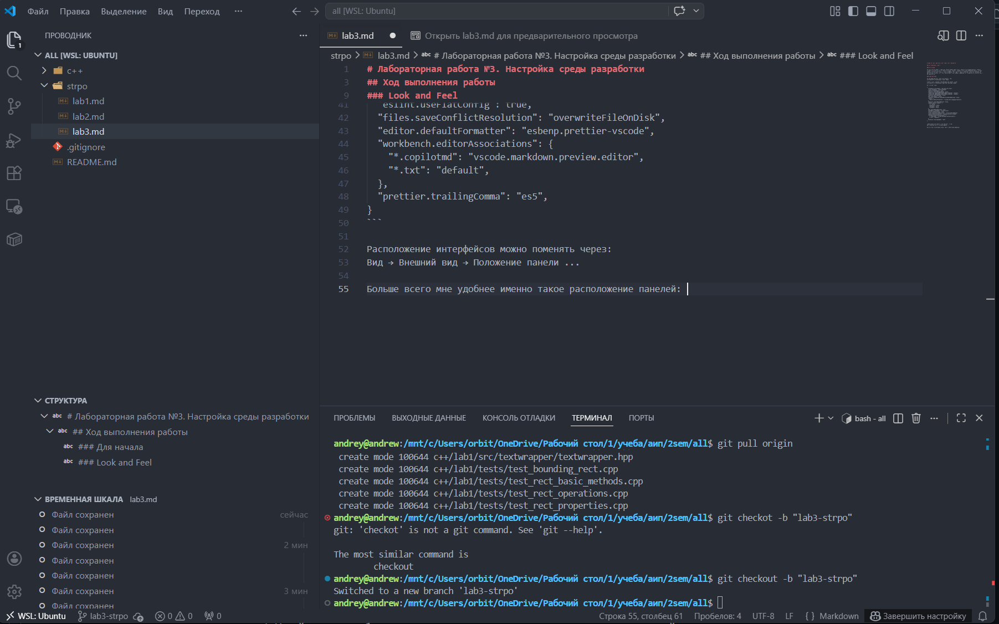

# Лабораторная работа №3. Настройка среды разработки

## Ход выполнения работы

### Для начала

Для большинства задач я использую Visual Studio Code. В нем я пишу код на TypeScript/C++, выполняю команды в консоли через встроенный терминал, работаю с Docker (расширение Container Tools), а также навигирую по проекту с помощью боковой панели. Для работы с Git я использую расширению GitLens. В качестве альтернатив, которыми я пользовался можно назвать WebStorm, но он платный, да и VS Codе мне показался удобнее

### Look and Feel

Для VS Code цветовую тему можно поменять так:
Ctrl+Shift+P → Preferences: Color Theme 

Шрифты и часть внешнего вида удобнее настраивать через:
Ctrl+Shift+P → Preferences: Open User Settings (JSON).

Мои настройки:
```
{
  "workbench.colorTheme": "One Dark Pro Flat",
  "files.autoSave": "onFocusChange",
  "editor.formatOnSave": true,
  "explorer.confirmDragAndDrop": false,
  "typescript.updateImportsOnFileMove.enabled": "always",
  "javascript.updateImportsOnFileMove.enabled": "always",
  "explorer.confirmDelete": false,
  "git.confirmSync": false,
  "terminal.integrated.enableMultiLinePasteWarning": false,
  "[html]": {
    "editor.defaultFormatter": "vscode.html-language-features",
  },
  "explorer.confirmPasteNative": false,
  "github.copilot.enable": {
    "*": false,
    "plaintext": false,
    "markdown": false,
    "scminput": false,
  },
  "git.ignoreRebaseWarning": true,
  "workbench.iconTheme": "vscode-icons",
  "eslint.useFlatConfig": true,
  "files.saveConflictResolution": "overwriteFileOnDisk",
  "editor.defaultFormatter": "esbenp.prettier-vscode",
  "workbench.editorAssociations": {
    "*.copilotmd": "vscode.markdown.preview.editor",
    "*.txt": "default",
  },
  "prettier.trailingComma": "es5",
}
```

Расположение интерфейсов можно поменять через:
Вид → Внешний вид → Положение панели ...

Больше всего мне удобно именно такое расположение панелей: 



Далее я настроил приглашение ко вводу в bash через файл ~/.bashrc, изменив переменную PS1 и добавив только отображение текущей ветки Git:
```PS1='${debian_chroot:+($debian_chroot)}\[\033[01;32m\]\u@\h\[\033[00m\]:\[\033[01;34m\]\w\[\033[00m\] \[\033[01;33m\]$(git branch 2>/dev/null | grep "^\*" | cut -c3-)\[\033[00m\]\$ '```

### Эргономика работы с кодом

- **Несколько полезных горячих клавиш:**
  - `Ctrl+Enter` — вставить строку ниже
  - `Ctrl+Shift+K` — удалить строку
  - `Alt+↑ / Alt+↓` — переместить строку вверх или вниз
  - `Shift+Alt+A` — закомментировать или раскомментировать блок кода

- **Поиск по содержанию файлов:**
  - `Ctrl+Shift+F`

- **Перейти к объявлению функции или типа:**
  - `F12`

- **Перейти к реализации функции или типа:**
  - `Ctrl+F12`

- **Найти все места, где используется переменная, функция или тип:**
  - `Shift+F12`

- **Переименовать все вхождения переменной, функции или типа:**
  - `F2`

- **Быстро перемещаться между важными местами кода:**
  - `Ctrl+P` — быстро открыть файл
  - `Ctrl+Shift+O` — перейти к символу в текущем файле
  - `Ctrl+Tab` — перейти к недавно открытым файлам
  - `Alt+Left / Alt+Right` — назад и вперед по истории переходов

- **Комментировать и раскомментировать большие части кода:**
  - `Shift+Alt+A` — блочный комментарий
  - `Ctrl+/` — построчный комментарий

### Кастомизация процессов

В VS Code свои горячие клавиши можно настроить через `Ctrl+K Ctrl+S` или через `Ctrl+Shift+P → Preferences: Open Keyboard Shortcuts (JSON)`. К клавишам можно привязывать как встроенные команды редактора, так и пользовательские действия, например запуск задач.

Я настроил дополнительно следующие горячие клавиши: 
- Сборка — Ctrl + Shift + B
- Запуск — F6
- Тесты — F7

Для автоматизации сборки, запуска и тестов в VS Code используется файл `.vscode/tasks.json`.

Мой `tasks.json`:

```
{
  "version": "2.0.0",
  "tasks": [
    {
      "label": "build",
      "type": "shell",
      "command": "npm run build",
      "group": "build"
    },
    {
      "label": "start",
      "type": "shell",
      "command": "npm run dev"
    },
    {
      "label": "lint",
      "type": "shell",
      "command": "npm run lint"
    },
    {
      "label": "test",
      "type": "shell",
      "command": "npm run test",
      "group": "test"
    }
  ]
}
```


### Интеграция с гитом

Я работаю с git через встроенную вкладку "Система управлениями версиями". Редактор автоматически распознает git и показывает изменения, индекс, коммиты и синхронизацию с удаленным репозиторием

- **Просмотр изменений**  
  Открыть вкладку и нажать на измененный файл, чтобы посмотреть diff. Также можно использовать кнопку "Открыть изменения" у текущего файла

- **Добавление файлов в индекс**  
  Во вкладке нажать "+" рядом с файлом или "Хранить все промежуточные изменения" для всех файлов сразу. VS Code также поддерживает выборочное добавление отдельных фрагментов

- **Коммиты**  
  Ввести сообщение коммита в поле сверху во вкладке и нажать кнопку "Фиксация"

- **Добавление удаленного репозитория**  
  Это можно сделать через команды git в терминале или через встроенные команды публикации и работы с remote-репозиториями. Я всегда использую `git clone` в терминале 

- **Получение обновлений из удаленного репозитория**  
  Во вкладке доступны команды "Получить", "Извлечь" и "Синхронизировать изменения"

- **Отправка обновлений в удаленный репозиторий**  
  После коммита можно выполнить "Синхронизировать изменения"/"Опубликовать Branch" через интерфейс

- **Разрешение конфликтов**  
  При конфликте VS Code показывает проблемные файлы во вкладке. Их можно открыть и решить конфликт через встроенные действия, например принять текущее изменение, входящее изменение или оба варианта.

