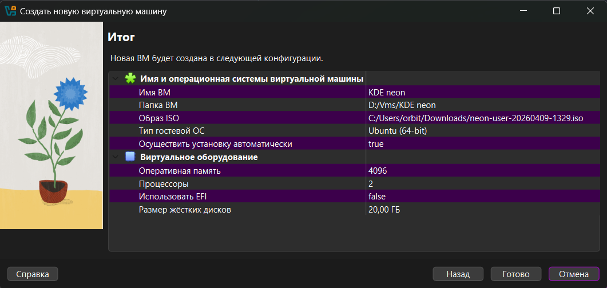
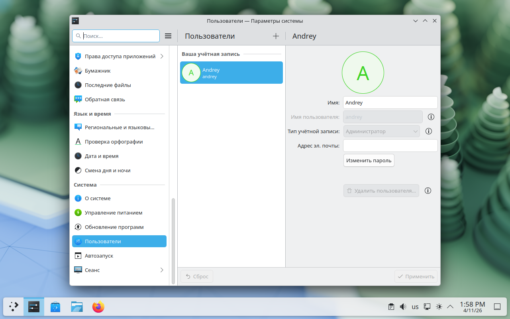

# Лабораторная работа №4. Знакомство с Linux

## Ход выполнения работы

### Выбор варианта

Свой вариант я определил по MD5-хэшу ФИО:

```
andrey@andrew:/mnt/c/Users/orbit/OneDrive/Рабочий стол/1/учеба/аип/2sem/all$ echo "Михайленко Андрей Валерьевич" | md5sum 
d07a91051cebda6215dd15c318c266c9  -
```

Первый символ хэша - d, значит мой вариант - KDE neon.

### Изучение особенностей дистрибутива

1. **Кто разрабатывает и поддерживает**  
   KDE neon разрабатывает и поддерживает сообщество KDE.

2. **Базовый дистрибутив**  
   KDE neon основан на Ubuntu 24.04 LTS.

3. **Релизы**  
   Обновления в KDE neon выходят регулярно: новые версии KDE-пакетов приходят постоянно, а система обновляется вместе с Ubuntu LTS. Сейчас актуальная версия User Edition на базе Ubuntu 24.04 LTS.

4. **Где изучать дистрибутив**  
   Для изучения можно использовать:
   - официальный сайт KDE neon;
   - FAQ KDE neon;
   - документацию и страницы поддержки KDE.

5. **Пакетный менеджер**  
   Используется APT

6. **Как работать с пакетами**  
   - поиск пакетов: `apt search имя_пакета`
   - установка: `sudo apt install имя_пакета`
   - обновление списка пакетов: `sudo apt update`
   - обновление системы: `sudo apt full-upgrade`
   - удаление: `sudo apt remove имя_пакета`
   - полное удаление: `sudo apt remove --purge имя_пакета`
   - очистка лишних зависимостей: `sudo apt autoremove`

7. **Как устанавливается дистрибутив**  
   Нужно скачать User Edition, загрузиться с ISO-образа и пройти стандартную установку: выбрать язык, раскладку, часовой пояс и тд.

8. **Минимальные системные требования**  
   Минимальные требования у KDE neon такие:
   - 64-битный процессор;
   - 2 ГБ оперативной памяти;
   - 10 ГБ места на диске.

9. **Оконный менеджер**  
    В KDE neon используется рабочая среда KDE Plasma, а оконный менеджер - KWin.


### Установка ОС

Для установки я использовал ISO-образ KDE neon и Virtual Box.
Создал виртуальную машину c такими параметрами:



Далее выбрал язык, часовой пояс, раскладку клавиатуры, создал пользователя. После установки OC перезагрузилась

### Настройка и установка пакетов

#### Возможность открывать несколько программ (окон), переключаться между ними.

Это в KDE neon работает сразу после установки, отдельно ничего ставить не нужно

#### Отслеживание ресурсов и управление процессами.

Для этого можно использовать Plasma System Monitor.

Установка через терминал:

```sudo apt install plasma-systemmonitor```

После установки программу можно открыть через меню приложений


#### Настройка логина/пароля пользователя; блокировка экрана.

Это делается через Параметры системы

Там можно:
- менять пароль пользователя;
- настраивать вход в систему;
- включать блокировку экрана.



Здесь отдельный пакет не нужен

#### Настройка сетевых подключений

Это тоже делается без отдельных пакетов:
- через значок сети на панели;
- или через Параметры системы.

Через них можно подключаться к Wi-Fi, менять параметры сети и смотреть текущее соединение.

#### Работа с файловой системой (файловый менеджер или проводник).

Для этого используется файловый менеджер Dolphin.
У меня он уже был установлен, но при необходимости его можно поставить так:
```sudo apt install dolphin```

#### Выход в интернет

У меня уже был установлен Firefox.
Но можно установить и другой через команду:
```sudo apt install [название браузера]```

### Инструменты для разработки

Для разработки установил:
- компилятор - gcc;
- отладчик - gdb;
- среду разработки - kdevelop.

Команда установки:

```sudo apt install build-essential gdb kdevelop```