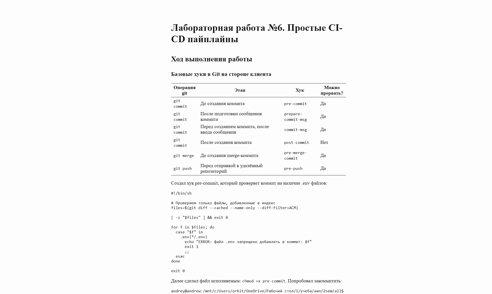

# Лабораторная работа №6. Простые CI-CD пайплайны

## Ход выполнения работы

### Базовые хуки в Git на стороне клиента

| Операция git | Этап                                           | Хук                  | Можно прервать? |
| ------------ | ---------------------------------------------- | -------------------- | --------------- |
| `git commit` | До создания коммита                            | `pre-commit`         | Да              |
| `git commit` | После подготовки сообщения коммита             | `prepare-commit-msg` | Да              |
| `git commit` | Перед созданием коммита, после ввода сообщения | `commit-msg`         | Да              |
| `git commit` | После создания коммита                         | `post-commit`        | Нет             |
| `git merge`  | До создания merge-коммита                      | `pre-merge-commit`   | Да              |
| `git push`   | Перед отправкой в удалённый репозиторий        | `pre-push`           | Да              |

Создал хук pre-commit, который проверяет коммит на наличие .env файлов:
```
#!/bin/sh

# Проверяем только файлы, добавленные в индекс
files=$(git diff --cached --name-only --diff-filter=ACM)

[ -z "$files" ] && exit 0

for f in $files; do
  case "$f" in
    .env|*/.env)
      echo "ERROR: файл .env запрещено добавлять в коммит: $f"
      exit 1
      ;;
  esac
done

exit 0
```

Далее сделал файл исполняемым: `chmod +x pre-commit`.
Попробовал закоммитить:
```
andrey@andrew:/mnt/c/Users/orbit/OneDrive/Рабочий стол/1/учеба/аип/2sem/all$ git commit -m "add env"
ERROR: файл .env запрещено добавлять в коммит: .env
```

Дальше сделал хук commit-msg, который проверяет сообщение коммита по выражению (type: project): (description), 
где type - conventional commits,
project - c++/strpo

```
#!/bin/sh

msg_file="$1"
msg=$(head -n 1 "$msg_file")

echo "$msg" | grep -Eq '^\((feat|fix|docs|test|refactor|chore): (stro|c\+\+)\): .+' || {
  echo "ERROR: неверный формат commit message"
  echo "Используйте формат: (type: project): description"
  echo "Примеры:"
  echo "  (feat: c++): ..."
  echo "  (fix: strpo): ..."
  exit 1
}

exit 0
```

Попробовал закоммитить:
```
git commit -m "random message"
ERROR: неверный формат commit message
Используйте формат: (type: project): description
Примеры:
  (feat: c++): ...
  (fix: strpo): ...
```


### Хуки Git на стороне сервера

Я скопировал репозиторий и добавил remote:
```
andrey@andrew:/mnt/c/Users/orbit/OneDrive/Рабочий стол/1/учеба/аип/2sem/all$ git remote add server ..\labs-2sem   
andrey@andrew:/mnt/c/Users/orbit/OneDrive/Рабочий стол/1/учеба/аип/2sem/all$ git remote -v  
origin  https://github.com/AndreyFrekostya/labs-2sem.git (fetch)
origin  https://github.com/AndreyFrekostya/labs-2sem.git (push)
server  ..\labs-2sem (fetch)
server  ..\labs-2sem (push)
```

Создал hook post-receive (конвертирует через Pandoc):
```
#!/bin/sh

TARGET_BRANCH="refs/heads/lab6-strpo"
PROJECT_DIR="$(cd ../.. && pwd)"
MD_FILE="$PROJECT_DIR/labs-2sem/strpo/lab6.md"
HTML_FILE="$PROJECT_DIR/labs-2sem/strpo/lab6.html"

while read oldrev newrev refname
do
  if [ "$refname" = "$TARGET_BRANCH" ]; then
    pandoc -s "$MD_FILE" -o "$HTML_FILE"
  fi
done
```

Ввел в клоне комманду, которая говорит, что если в checkout ветку пришел пуш, то ее нужно обновить:
```
git config receive.denyCurrentBranch updateInstead
```

Далее запушил изменения на server:
```
git push server lab6-strpo
Enumerating objects: 7, done.
Counting objects: 100% (7/7), done.
Delta compression using up to 16 threads
Compressing objects: 100% (4/4), done.
Writing objects: 100% (4/4), 758 bytes | 94.00 KiB/s, done.
Total 4 (delta 3), reused 0 (delta 0), pack-reused 0
remote: [WARNING] This document format requires a nonempty <title> element.
remote:   Defaulting to 'lab6' as the title.
remote:   To specify a title, use 'title' in metadata or --metadata title="...".
To ../labs-2sem
   4181071..a7caea6  lab6-strpo -> lab6-strpo
```

.html создался:


### Сборка с помощью CMake

Основные понятия cmake:

- **project** — проект
- **target** — цель сборки
- **library** — библиотека
- **executable** — исполняемый файл

Основные конструкции cmake:

- **project(...)** — объявляет проект  
- **add_executable(...)** — создаёт исполняемый файл  
- **add_library(...)** — создаёт библиотеку  
- **target_link_libraries(...)** — подключает библиотеку к другой цели  
- **target_include_directories(...)** — задаёт пути к заголовочным файлам  
- **add_subdirectory(...)** — подключает поддиректорию с другим CMakeLists.txt
- **enable_testing()** — включает поддержку тестов  
- **add_test(...)** — добавляет тест для ctest

Далее написал два CMakeLists.txt

Как запускать:
1. Сконфигурировать проект `cmake -S . -B build`
2. Собрать `cmake --build build`
3. Запустить основную программу `./build/main_app`
4. Запустить все тесты `ctest --test-dir build`
