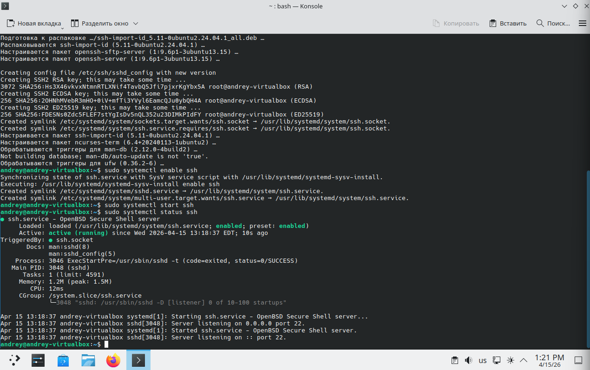
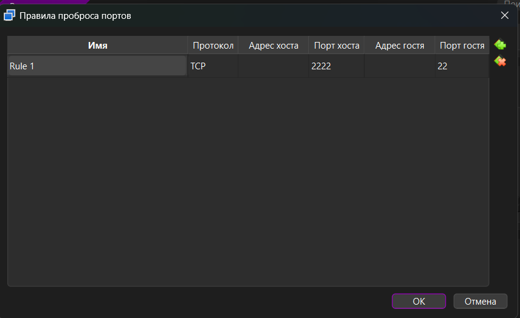
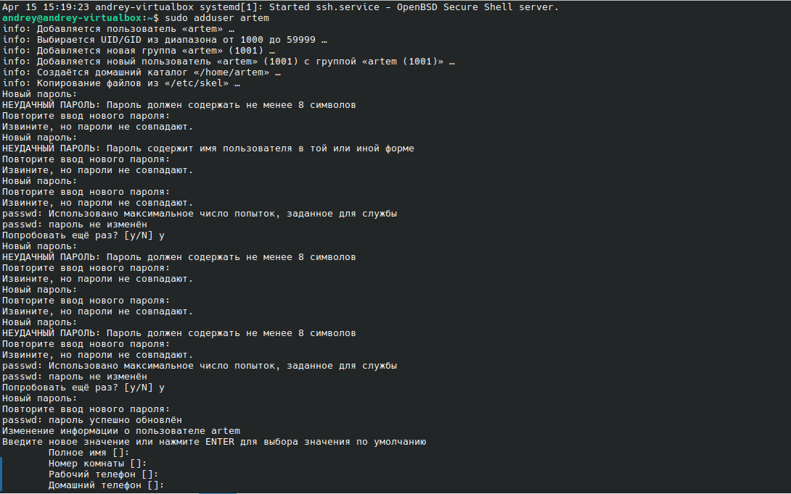

# Лабораторная работа №7. Развертывание на целевой машине.

## Ход выполнения работы

### Создание виртуальной машины

В работе №4 я использовал вариант D: KDE Neon + Virtual Box.
Процесс установки системы я выполнил в работе №4.

Другой пользователь почти наверняка будет иметь доступ:
- к своей домашней директории;
- к общедоступным каталогам и файлам с правами на чтение;
- к файлам проекта, если я дам на них права;
- к временным каталогам, логам и части системной информации, если права это позволяют.

Он не должен автоматически получать доступ к моим личным файлам , SSH-ключам, токенам, приватным репозиториям и паролям — но получит, если:
- я выдам ему мой логин вместо отдельного пользователя;
- выставлю слишком широкие права;
- положу чувствительные файлы в общие каталоги;

### Настройка удаленного доступа


В консоли выполнил команды:
```
sudo apt install -y openssh-server
sudo systemctl enable ssh
sudo systemctl start ssh
sudo systemctl status ssh
```

Результат: 



Это означает, что:
- сервис ssh найден системой и включён в автозапуск.
- сервер запущен прямо сейчас.
- SSH слушает все IPv4-интерфейсы на стандартном порту 22.

TCP-порт — это числовой идентификатор внутри сетевого соединения, который позволяет понять, какой именно программе нужно передать пришедшие данные.

Например:
- 22 — SSH
- 80 — HTTP
- 443 — HTTPS

Пробрасывание портов — это перенаправление соединения с одного адреса и порта на другой адрес и порт:
- подключение приходит на хостовую машину,
- VirtualBox перехватывает его,
- и пересылает внутрь виртуальной машины.

Настроил пробросов портов:



Затем проверил его:
```
C:\Users\orbit>ssh andrey@127.0.0.1 -p 2222
The authenticity of host '[127.0.0.1]:2222 ([127.0.0.1]:2222)' can't be established.
ED25519 key fingerprint is SHA256:FDESNs0Zdc5FLEF7stYgIsDv5nQL352u23DIMkPIdFY.
This key is not known by any other names.
Are you sure you want to continue connecting (yes/no/[fingerprint])? yes
Warning: Permanently added '[127.0.0.1]:2222' (ED25519) to the list of known hosts.
andrey@127.0.0.1's password:
Welcome to KDE neon User Edition (GNU/Linux 6.17.0-20-generic x86_64)

Расширенное поддержание безопасности (ESM) для Applications выключено.

16 обновлений может быть применено немедленно.
12 из этих обновлений, являются стандартными обновлениями безопасности.
Чтобы просмотреть дополнительные обновления выполните: apt list --upgradable

Включите ESM Apps для получения дополнительных будущих обновлений безопасности.
Смотрите https://ubuntu.com/esm или выполните: sudo pro status


The programs included with the KDE neon system are free software;
the exact distribution terms for each program are described in the
individual files in /usr/share/doc/*/copyright.

KDE neon comes with ABSOLUTELY NO WARRANTY, to the extent permitted by
applicable law.
```

Как добавить  публичный ключ:
- Если ключа еще нет, то на хосте: `ssh-keygen -t ed25519`
- Вывести публичный ключи скопировать: `type $env:USERPROFILE\.ssh\id_ed25519.pub`
- Затем команды: 
```
andrey@andrey-virtualbox:~$ mkdir -p ~/.ssh (создать папку)
andrey@andrey-virtualbox:~$ chmod 700 ~/.ssh (изменить права доступа, владелец может: читать, писать и заходить в каталог)
andrey@andrey-virtualbox:~$ nano ~/.ssh/authorized_keys (вывести содержимое файла)
```
И вставил скопированную строку

Затем попробовал подключиться без пароля:
```
C:\Users\orbit>ssh andrey@127.0.0.1 -p 2222
Welcome to KDE neon User Edition (GNU/Linux 6.17.0-20-generic x86_64)

Расширенное поддержание безопасности (ESM) для Applications выключено.

16 обновлений может быть применено немедленно.
12 из этих обновлений, являются стандартными обновлениями безопасности.
Чтобы просмотреть дополнительные обновления выполните: apt list --upgradable

Включите ESM Apps для получения дополнительных будущих обновлений безопасности.
Смотрите https://ubuntu.com/esm или выполните: sudo pro status

Failed to connect to https://releases.neon.kde.org/meta-release-lts. Check your Internet connection or proxy settings (KDE Neon при входе пытается проверить информацию об обновлениях и не может достучаться до этого ресурса)

Last login: Wed Apr 15 14:33:20 2026 from 10.0.2.2
```

Далее на ВМ отключил доступ по паролю в конфиге: `sudo nano /etc/ssh/sshd_config`
Там привел строки: 
```
#PasswordAuthentication yes  
#PasswordAuthentication yes
```
к виду:
```
PasswordAuthentication no
PubkeyAuthentication yes
```

Проверил подключение по паролю:
```
ssh -o PreferredAuthentications=password -o PubkeyAuthentication=no andrey@127.0.0.1 -p 2222
andrey@127.0.0.1: Permission denied (publickey).
```

### Настройка сессии для другого пользователя

Добавил нового пользователя:



Дальше на хосте добавил приватный ключ напарника в ВМ:
```
andrey@andrey-virtualbox:~$ sudo nano /home/artem/.ssh/authorized_keys
[sudo] пароль для andrey:
andrey@andrey-virtualbox:~$
```

Далее в сети посмотрел ip-адрес с помощью ipconfig (192.168.31.8):
```
Windows IP Configuration

Wireless LAN adapter Беспроводная сеть:

   Connection-specific DNS Suffix  . :
   Link-local IPv6 Address . . . . . : fe80::7140:3160:53d7:d81a%21
   IPv4 Address. . . . . . . . . . . : 192.168.31.121
   Subnet Mask . . . . . . . . . . . : 255.255.255.0
   Default Gateway . . . . . . . . . : 192.168.31.1
```

Далее сделал пинг:
```
ping 192.168.31.130

Pinging 192.168.31.130 with 32 bytes of data:
Reply from 192.168.31.130: bytes=32 time=5ms TTL=128
Reply from 192.168.31.130: bytes=32 time=5ms TTL=128
Reply from 192.168.31.130: bytes=32 time=11ms TTL=128
Reply from 192.168.31.130: bytes=32 time=5ms TTL=128

Ping statistics for 192.168.31.130:
    Packets: Sent = 4, Received = 4, Lost = 0 (0% loss),
Approximate round trip times in milli-seconds:
    Minimum = 5ms, Maximum = 11ms, Average = 6ms
```

Напарник открыл порт 2222 для подключений через брэндмауэр. Дальше я попробовал подключиться:
```
ssh Andrey@192.168.31.130 -p 2222
Welcome to Ubuntu 25.10 (GNU/Linux 6.17.0-19-generic x86_64)

 * Documentation:  https://docs.ubuntu.com
 * Management:     https://landscape.canonical.com
 * Support:        https://ubuntu.com/pro

165 updates can be applied immediately.
60 of these updates are standard security updates.
To see these additional updates run: apt list --upgradable


The programs included with the Ubuntu system are free software;
the exact distribution terms for each program are described in the
individual files in /usr/share/doc/*/copyright.

Ubuntu comes with ABSOLUTELY NO WARRANTY, to the extent permitted by
applicable law.
```

Дальше я сделал `sudo apt update`, 

Дальше установил зависимости:
```
Andrey@Ubuntu:~$ sudo apt install -y git build-essential cmake gdb
build-essential is already the newest version (12.12ubuntu1).
Installing:
  cmake  git

Installing dependencies:
  cmake-data  git-man  liberror-perl  libjsoncpp26  librhash1

...
```

Установленные зависимости:
- git 
- cmake
- gdb

Для доступа к приватному репозиторию не следует копировать основной приватный SSH-ключ на удалённую машину. Это опасно, поскольку при взломе этой машины злоумышленник сможет использовать ключ для доступа к приватным репозиториям и другим связанным ресурсам от имени владельца ключа. Возможно безопасным решением является использование отдельного временного ключа.

Далее склонировал репозиторий:
```
Andrey@Ubuntu:~$ git clone https://github.com/AndreyFrekostya/labs-2sem.git
Cloning into 'labs-2sem'...
remote: Enumerating objects: 376, done.
remote: Counting objects: 100% (49/49), done.
remote: Compressing objects: 100% (46/46), done.
remote: Total 376 (delta 8), reused 10 (delta 2), pack-reused 327 (from 1)
Receiving objects: 100% (376/376), 1.25 MiB | 2.33 MiB/s, done.
Resolving deltas: 100% (102/102), done.
```

Сделал конфигурацию билда:
```
Andrey@Ubuntu:~/labs-2sem/c++/lab1$ cmake -S . -B build
-- Configuring done (0.0s)
-- Generating done (0.0s)
-- Build files have been written to: /home/Andrey/labs-2sem/c++/lab1/build
```

Сбилдил:
```
Andrey@Ubuntu:~/labs-2sem/c++/lab1$ cmake --build build
[  6%] Building CXX object CMakeFiles/lab1_library.dir/src/barrel/barrel.cpp.o
[ 12%] Building CXX object CMakeFiles/lab1_library.dir/src/matrix/matrix.cpp.o
[ 18%] Building CXX object CMakeFiles/lab1_library.dir/src/mystring/mystring.cpp.o
[ 25%] Building CXX object CMakeFiles/lab1_library.dir/src/rect/rect.cpp.o
[ 31%] Building CXX object CMakeFiles/lab1_library.dir/src/textwrapper/textwrapper.cpp.o
[ 37%] Linking CXX static library liblab1_library.a
[ 37%] Built target lab1_library
[ 43%] Building CXX object CMakeFiles/main_app.dir/src/main.cpp.o
[ 50%] Linking CXX executable main_app
[ 50%] Built target main_app
[ 56%] Building CXX object tests/CMakeFiles/test_bounding_rect.dir/test_bounding_rect.cpp.o
[ 62%] Linking CXX executable test_bounding_rect
[ 62%] Built target test_bounding_rect
[ 68%] Building CXX object tests/CMakeFiles/test_rect_basic_methods.dir/test_rect_basic_methods.cpp.o
[ 75%] Linking CXX executable test_rect_basic_methods
[ 75%] Built target test_rect_basic_methods
[ 81%] Building CXX object tests/CMakeFiles/test_rect_operations.dir/test_rect_operations.cpp.o
[ 87%] Linking CXX executable test_rect_operations
[ 87%] Built target test_rect_operations
[ 93%] Building CXX object tests/CMakeFiles/test_rect_properties.dir/test_rect_properties.cpp.o
[100%] Linking CXX executable test_rect_properties
[100%] Built target test_rect_properties
```

Запустил основной файл:
```
Andrey@Ubuntu:~/labs-2sem/c++/lab1/build$ ./main_app
Конструктор по умолчанию 0x7fffa282d7c0
Деструктор 0x7fffa282d7c0
Конструктор 0x7fffa282d7c0
Деструктор 0x7fffa282d7c0
Конструктор 0x7fffa282d7a0
Конструктор копирования 0x7fffa282d7b0
Конструктор копирования 0x7fffa282d7c0
Деструктор 0x7fffa282d7c0
Деструктор 0x7fffa282d7b0
Деструктор 0x7fffa282d7a0
Конструктор по умолчанию 0x7fffa282d790
Конструктор 0x653f5f078730
...
```

Запустил тесты:
```
Andrey@Ubuntu:~/labs-2sem/c++/lab1/build$ ctest
Test project /home/Andrey/labs-2sem/c++/lab1/build
    Start 1: test_bounding_rect
1/4 Test #1: test_bounding_rect ...............   Passed    0.00 sec
    Start 2: test_rect_basic_methods
2/4 Test #2: test_rect_basic_methods ..........   Passed    0.00 sec
    Start 3: test_rect_operations
3/4 Test #3: test_rect_operations .............   Passed    0.00 sec
    Start 4: test_rect_properties
4/4 Test #4: test_rect_properties .............   Passed    0.00 sec

100% tests passed, 0 tests failed out of 4

Total Test time (real) =   0.02 sec
```